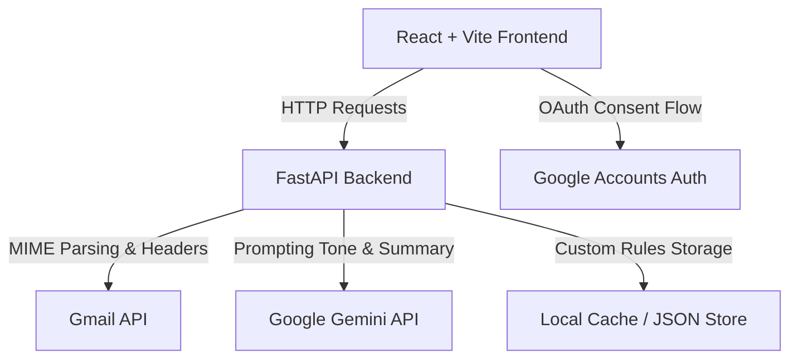

# InboxIQ

InboxIQ is a production-grade, AI-powered smart email client built on top of the Gmail API. It leverages Google's Gemini models to provide real-time email prioritization, rich summaries, suggested action lists, tone-specific draft responses, and natural language semantic searching.

---

## Architecture Diagram



---

## Core Features

- **📬 Full Email Client**: Lazily loads and parses complete email bodies (multipart MIME support) with full formatting.
- **⭐ Gmail Quick Actions**: Optimistic UI triggers for toggling stars, marking read/unread, and archiving inbox messages with a multi-second Undo overlay.
- **⚡ Gemini AI Priority Classifier**: Replaces static rule-based prioritization with a fine-tuned Gemini analysis evaluating messages as Urgent, Important, Normal, or Low Priority.
- **📝 Intelligent AI Drafts**: Instantly generates contextual reply drafts matching four tones (Professional, Friendly, Formal, and Short) with a copy-clipboard toggle.
- **🔎 Natural Language Semantic Search**: Filter and lookup messages using instant keywords or semantic dates (e.g., "emails from github today", "urgent interview").
- **📅 Daily Digest Summary**: Provides a visual metadata card indicating read times, urgency counters, and a checkbox checklist of critical action items.

---

## Tech Stack

- **Frontend**: React, Vite, Vanilla CSS
- **Backend**: FastAPI, Python 3.11+, Uvicorn
- **SDKs & APIs**: Google APIs Client, `google-genai` (Gemini SDK), standard email/MIME modules.

---

## Installation & Setup

### Environment Variables
Configure a `.env` file at the root of the project:

```env
# FastAPI Configurations
SECRET_KEY=production-session-cookie-secret-key
DEBUG=0
SESSION_SECURE=1
CORS_ORIGINS=https://inboxiq-client.vercel.app,http://localhost:5173

# Google OAuth Credentials
GOOGLE_CLIENT_ID=your-google-oauth-client-id
GOOGLE_CLIENT_SECRET=your-google-oauth-client-secret
GOOGLE_REDIRECT_URI=https://inboxiq-api.onrender.com/api/auth/google/callback
FRONTEND_URL=https://inboxiq-client.vercel.app

# Google Gemini Credentials
GEMINI_API_KEY=your-gemini-api-key
```

### Running Locally

1. **Backend**:
   ```bash
   cd backend
   python -m venv venv
   source venv/bin/activate  # On Windows: venv\Scripts\activate
   pip install -r requirements.txt
   python run.py
   ```
2. **Frontend**:
   ```bash
   cd frontend
   npm install
   npm run dev
   ```

---

## Deployment

### Frontend (Vercel)
Set up the environment variables on Vercel:
- `VITE_API_BASE_URL` pointing to the Render backend URL.
- Deploy Vite output using the Vercel builder.

### Backend (Render)
Configure a Web Service on Render:
- **Build Command**: `pip install -r requirements.txt`
- **Start Command**: `uvicorn app.main:app --host 0.0.0.0 --port $PORT`
- Set all environment variables (including `SESSION_SECURE=1`).

---

## License

This project is licensed under the MIT License.
